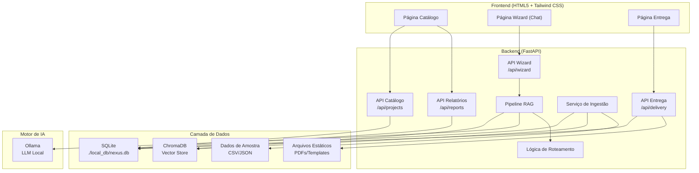
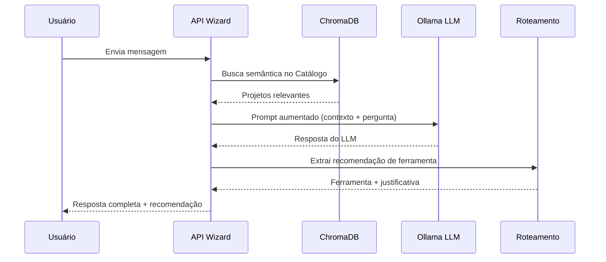

# Documento de Design

## Visão Geral

A Plataforma Nexus é uma aplicação monolítica local-first composta por três módulos: Catálogo, Wizard e Entrega. O backend é construído em Python 3.10+ com FastAPI, servindo tanto a API REST quanto os arquivos estáticos do frontend. O frontend utiliza HTML5/JavaScript vanilla com Tailwind CSS via CDN. Os dados são persistidos em SQLite (`./local_db/nexus.db`) e as embeddings vetoriais no ChromaDB local. O Wizard utiliza um LLM local via Ollama para processamento de linguagem natural e RAG (Retrieval-Augmented Generation).

## Arquitetura



### Fluxo do Pipeline RAG (Wizard)



## Componentes e Interfaces

### Módulo A: Catálogo (Ingestão e Consulta)

**Serviço de Ingestão (`api/ingestion.py`)**
- `ingest_file(file_path: str) -> IngestResult`: Lê CSV/JSON, valida campos obrigatórios, insere/atualiza no SQLite e indexa no ChromaDB.
- `seed_sample_data() -> None`: Carrega dados de amostra na inicialização.

**API de Projetos (`api/routes/projects.py`)**
- `GET /api/projects` → Lista todos os projetos com paginação.
- `GET /api/projects/{project_id}` → Detalhes de um projeto.
- `GET /api/projects?search={term}` → Busca por nome/descrição.
- `GET /api/projects?source={fonte}` → Filtra por fonte.

**API de Relatórios (`api/routes/reports.py`)**
- `GET /api/reports/executive` → Gera relatório executivo com contagem por fonte e status.

### Módulo B: Wizard (RAG + Roteamento)

**Pipeline RAG (`api/rag.py`)**
- `query_catalog(text: str) -> list[Project]`: Busca semântica no ChromaDB.
- `build_prompt(query: str, context: list[Project]) -> str`: Constrói prompt aumentado.
- `get_llm_response(prompt: str) -> str`: Chama o Ollama e retorna resposta.

**Lógica de Roteamento (`api/routing.py`)**
- `extract_recommendation(llm_response: str) -> ToolRecommendation`: Extrai a ferramenta recomendada da resposta do LLM.
- `AVAILABLE_TOOLS`: Lista de ferramentas disponíveis (Copilot, Lovable, n8n, Alteryx, Deep, Equipe BI, Equipe Deep, Squad, "Sem solução").

**API do Wizard (`api/routes/wizard.py`)**
- `POST /api/wizard/chat` → Recebe mensagem, executa pipeline RAG, retorna resposta com recomendação.

### Módulo C: Entrega (Procedimentos)

**API de Entrega (`api/routes/delivery.py`)**
- `GET /api/delivery/instructions/{tool_id}` → Retorna procedimento de acesso em formato estruturado.
- `GET /api/delivery/tools` → Lista todas as ferramentas com procedimentos disponíveis.

**Arquivos Estáticos**
- PDFs e templates servidos de `./data/delivery/`.

### Frontend

**Estrutura (`frontend/`)**
- `index.html` → Página principal com navegação entre seções.
- `catalogo.html` → Lista e busca de projetos + relatório executivo.
- `wizard.html` → Interface de chat.
- `entrega.html` → Procedimentos de acesso.
- `app.js` → Lógica JavaScript para chamadas à API e interação.

## Modelos de Dados

### Schemas Pydantic

```python
from pydantic import BaseModel, Field
from typing import Optional
from enum import Enum

class ProjectSource(str, Enum):
    N8N = "n8n"
    LOVABLE = "lovable"
    TI = "ti"
    DEEP = "deep"
    BI = "bi"

class ProjectStatus(str, Enum):
    ATIVO = "ativo"
    EM_DESENVOLVIMENTO = "em_desenvolvimento"
    CONCLUIDO = "concluido"
    PAUSADO = "pausado"

class ProjectCreate(BaseModel):
    name: str = Field(..., min_length=1)
    description: str = Field(..., min_length=1)
    source: ProjectSource
    owner: Optional[str] = None
    status: ProjectStatus = ProjectStatus.ATIVO
    technical_description: Optional[str] = None
    estimated_cost: str = Field(..., min_length=1)

class Project(ProjectCreate):
    id: int
    created_at: str
    updated_at: str

class ChatMessage(BaseModel):
    message: str = Field(..., min_length=1)

class ToolSolution(str, Enum):
    COPILOT = "copilot"
    LOVABLE = "lovable"
    N8N = "n8n"
    ALTERYX = "alteryx"
    BI_TEAM = "bi_team"
    DEEP_TEAM = "deep_team"
    SQUAD = "squad"
    NO_SOLUTION = "no_solution"

class WizardResponse(BaseModel):
    answer: str
    recommended_tool: Optional[ToolSolution] = None
    justification: Optional[str] = None
    similar_projects: list[Project] = []

class DeliveryProcedure(BaseModel):
    tool_id: ToolSolution
    tool_name: str
    steps: list[str]
    documentation_path: Optional[str] = None
    contact_info: Optional[str] = None

class ExecutiveReport(BaseModel):
    total_projects: int
    by_source: dict[str, int]
    by_status: dict[str, int]
    summary: str

class IngestResult(BaseModel):
    total_processed: int
    total_inserted: int
    total_updated: int
    errors: list[str]
```

### Schema SQLite

```sql
CREATE TABLE IF NOT EXISTS projects (
    id INTEGER PRIMARY KEY AUTOINCREMENT,
    name TEXT NOT NULL,
    description TEXT NOT NULL,
    source TEXT NOT NULL,
    owner TEXT,
    status TEXT NOT NULL DEFAULT 'ativo',
    technical_description TEXT,
    estimated_cost TEXT,
    created_at TIMESTAMP DEFAULT CURRENT_TIMESTAMP,
    updated_at TIMESTAMP DEFAULT CURRENT_TIMESTAMP
);

CREATE TABLE IF NOT EXISTS delivery_procedures (
    id INTEGER PRIMARY KEY AUTOINCREMENT,
    tool_id TEXT NOT NULL UNIQUE,
    tool_name TEXT NOT NULL,
    steps TEXT NOT NULL,  -- JSON array de strings
    documentation_path TEXT,
    contact_info TEXT
);

CREATE UNIQUE INDEX IF NOT EXISTS idx_projects_name_source ON projects(name, source);
```

### Estrutura de Diretórios

```
nexus-platform/
├── api/
│   ├── __init__.py
│   ├── main.py              # FastAPI app, startup, static files
│   ├── database.py           # Conexão SQLite, criação de tabelas
│   ├── ingestion.py          # Serviço de ingestão de arquivos
│   ├── rag.py                # Pipeline RAG (busca + prompt + LLM)
│   ├── routing.py            # Lógica de roteamento de ferramentas
│   ├── models.py             # Schemas Pydantic
│   └── routes/
│       ├── __init__.py
│       ├── projects.py       # Endpoints do Catálogo
│       ├── reports.py        # Endpoints de Relatórios
│       ├── wizard.py         # Endpoints do Wizard
│       └── delivery.py       # Endpoints de Entrega
├── frontend/
│   ├── index.html
│   ├── catalogo.html
│   ├── wizard.html
│   ├── entrega.html
│   └── app.js
├── data/
│   ├── samples/              # CSV/JSON de amostra
│   └── delivery/             # PDFs e templates
├── local_db/
│   └── nexus.db              # Banco SQLite (criado automaticamente)
├── requirements.txt
└── README.md
```


## Propriedades de Corretude

*Uma propriedade é uma característica ou comportamento que deve ser verdadeiro em todas as execuções válidas de um sistema — essencialmente, uma declaração formal sobre o que o sistema deve fazer. Propriedades servem como ponte entre especificações legíveis por humanos e garantias de corretude verificáveis por máquina.*

### Propriedade 1: Round-trip de ingestão com preservação de fonte

*Para qualquer* conjunto de registros de projetos válidos em formato CSV ou JSON, com campos obrigatórios preenchidos (nome, descrição, fonte), ao ingerir o arquivo e depois consultar o banco SQLite, todos os registros devem estar presentes com todos os campos preservados, incluindo a fonte original.

**Valida: Requisitos 1.1, 1.3**

### Propriedade 2: Rejeição de registros inválidos na ingestão

*Para qualquer* registro de projeto onde pelo menos um campo obrigatório (nome, descrição ou fonte) está ausente ou vazio, o serviço de ingestão deve rejeitar o registro, não inseri-lo no banco, e retornar uma mensagem de erro descritiva na lista de erros.

**Valida: Requisito 1.2**

### Propriedade 3: Idempotência de upsert

*Para qualquer* projeto válido, ingeri-lo N vezes (N >= 1) deve resultar em exatamente 1 registro no banco SQLite com o mesmo identificador (nome + fonte), e os dados devem refletir a última ingestão.

**Valida: Requisito 1.4**

### Propriedade 4: Corretude de filtros de busca e fonte

*Para qualquer* termo de busca textual, todos os projetos retornados pelo endpoint de busca devem conter o termo no nome ou na descrição. *Para qualquer* filtro de fonte válido, todos os projetos retornados devem ter a fonte igual ao filtro aplicado. Em ambos os casos, o conjunto de resultados deve ser um subconjunto do total de projetos.

**Valida: Requisitos 2.2, 2.4**

### Propriedade 5: Round-trip de detalhes do projeto

*Para qualquer* projeto inserido no banco com todos os campos preenchidos, ao consultar o endpoint de detalhes por ID, a resposta deve conter todos os campos (nome, descrição, descrição técnica, proprietário, fonte, status) com valores idênticos aos inseridos.

**Valida: Requisito 2.3**

### Propriedade 6: Consistência de contagens no relatório executivo

*Para qualquer* conjunto de projetos inseridos no banco, o relatório executivo deve satisfazer: (a) `total_projects` é igual ao número total de projetos no banco, (b) a soma dos valores em `by_source` é igual a `total_projects`, e (c) a soma dos valores em `by_status` é igual a `total_projects`.

**Valida: Requisito 3.1**

### Propriedade 7: Rejeição de mensagens em branco no Wizard

*Para qualquer* string composta inteiramente de caracteres de espaço em branco (espaços, tabs, newlines) ou string vazia, o endpoint do Wizard deve rejeitar a mensagem com um código de erro HTTP 422 e não alterar o estado do chat.

**Valida: Requisito 4.4**

### Propriedade 8: Validade da recomendação do Wizard

*Para qualquer* resposta do Wizard que inclua uma ferramenta recomendada, o valor de `recommended_tool` deve ser um membro válido do enum `ToolSolution`, e o campo `justification` deve ser uma string não vazia.

**Valida: Requisitos 5.2, 5.4**

### Propriedade 9: Completude do procedimento de entrega

*Para qualquer* `tool_id` que possui um procedimento cadastrado no banco, o endpoint de entrega deve retornar: (a) uma lista não vazia de `steps`, (b) o `tool_name` correspondente, e (c) se `documentation_path` está definido no banco, ele deve estar presente na resposta.

**Valida: Requisitos 6.1, 6.2, 6.3**

### Propriedade 10: Tratamento de erros para entrada inválida

*Para qualquer* requisição a um endpoint da API com parâmetros inválidos (tipos incorretos, valores fora do range, campos obrigatórios ausentes), a resposta deve ter um código HTTP na faixa 4xx e conter uma mensagem de erro descritiva no corpo.

**Valida: Requisito 8.2**

## Tratamento de Erros

### Erros de Ingestão
- Arquivo não encontrado ou formato inválido → Log de erro + retorno de `IngestResult` com lista de erros.
- Campos obrigatórios ausentes → Registro rejeitado individualmente, demais registros processados normalmente.
- Erro de escrita no SQLite → Exceção capturada, transação revertida, erro registrado.

### Erros do Wizard
- LLM indisponível (Ollama não rodando) → HTTP 503 com mensagem "Serviço de IA indisponível. Verifique se o Ollama está em execução."
- ChromaDB indisponível → HTTP 503 com mensagem "Serviço de busca indisponível."
- Mensagem vazia/whitespace → HTTP 422 com mensagem de validação Pydantic.
- Timeout do LLM → HTTP 504 com mensagem "Tempo de resposta excedido."

### Erros de Entrega
- `tool_id` não encontrado → HTTP 404 com mensagem "Procedimento em elaboração. Entre em contato com a equipe responsável."
- Arquivo PDF/template não encontrado no disco → HTTP 404 com mensagem descritiva.

### Erros Gerais da API
- Parâmetros inválidos → HTTP 422 (validação Pydantic automática do FastAPI).
- Recurso não encontrado → HTTP 404.
- Erro interno → HTTP 500 com mensagem genérica (sem expor detalhes internos).

## Estratégia de Testes

### Abordagem Dual: Testes Unitários + Testes Baseados em Propriedades

A estratégia de testes combina testes unitários para exemplos específicos e casos de borda com testes baseados em propriedades para validação universal.

### Framework de Testes
- **Testes unitários**: `pytest` com `httpx` (TestClient do FastAPI)
- **Testes baseados em propriedades**: `hypothesis` (biblioteca PBT para Python)
- **Mocking**: `unittest.mock` para simular Ollama e ChromaDB quando necessário

### Testes Unitários (Exemplos e Casos de Borda)
- Verificar que o LLM indisponível retorna HTTP 503 (Requisito 4.3)
- Verificar que "Não temos solução" aparece quando `tool` é `NO_SOLUTION` (Requisito 5.3)
- Verificar que `tool_id` inexistente retorna fallback de "em elaboração" (Requisito 6.4)
- Verificar que todos os endpoints REST existem e respondem (Requisito 8.1)
- Verificar que o banco é criado em `./local_db/nexus.db` (Requisito 8.4)
- Verificar que dados de amostra contêm >= 3 fontes, >= 10 projetos, >= 4 procedimentos (Requisitos 9.1, 9.2, 9.3)
- Verificar que dados de amostra são carregados na inicialização (Requisito 9.4)

### Testes Baseados em Propriedades (Hypothesis)
Cada teste de propriedade deve:
- Executar no mínimo 100 iterações
- Referenciar a propriedade do design com tag no formato: **Feature: ai-governance-platform, Property {N}: {título}**
- Ser implementado como um único teste por propriedade

| Propriedade | Descrição | Padrão |
|---|---|---|
| 1 | Round-trip de ingestão | Round-trip |
| 2 | Rejeição de registros inválidos | Condição de erro |
| 3 | Idempotência de upsert | Idempotência |
| 4 | Corretude de filtros | Metamórfico |
| 5 | Round-trip de detalhes | Round-trip |
| 6 | Consistência do relatório | Invariante |
| 7 | Rejeição de whitespace | Condição de erro |
| 8 | Validade da recomendação | Invariante |
| 9 | Completude da entrega | Invariante |
| 10 | Erros para entrada inválida | Condição de erro |

### Configuração do Hypothesis
```python
from hypothesis import settings, given, strategies as st

# Configuração global para mínimo de 100 exemplos
settings.register_profile("ci", max_examples=100)
settings.load_profile("ci")
```
