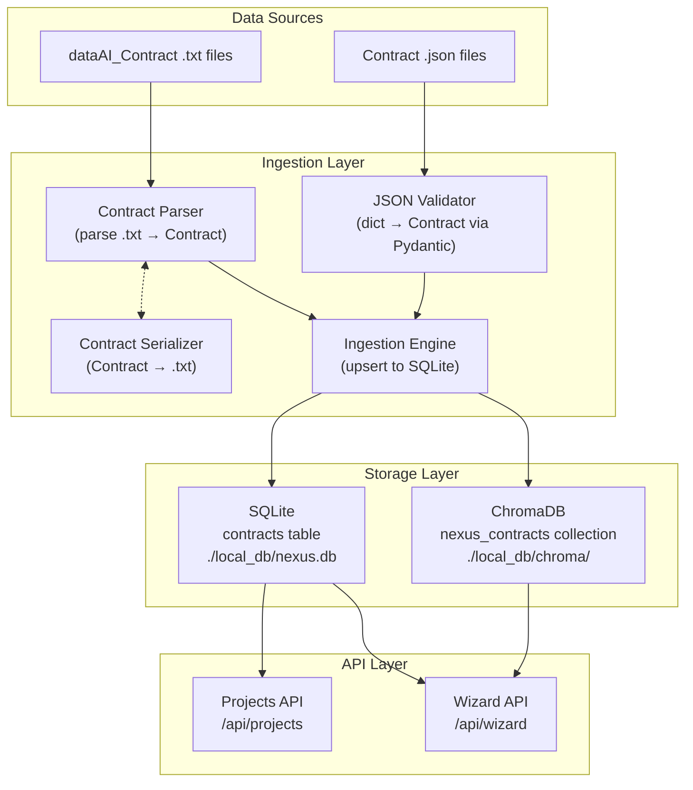

# Design Document: Contract Data Model

## Overview

This feature replaces the existing flat project schema with the richer `dataAI_Contract` format across the entire Nexus stack. The migration touches four layers: Pydantic models, SQLite schema, ingestion/parsing logic, and ChromaDB indexing. A dedicated parser/serializer pair handles the custom text format, while JSON ingestion is updated to validate against the new model. The existing `projects` table is replaced by a `contracts` table, and all API endpoints are updated to serve the enriched data.

The design keeps things simple and debuggable for a Junior Data Scientist — flat file structure, no ORMs beyond raw SQLite, and Pydantic for all validation.

## Architecture



## Components and Interfaces

### 1. Contract Model (`api/models.py`)

Updated Pydantic models replacing the old `Project`-based hierarchy.

```python
class ContractInitiative(str, Enum):
    BI = "BI"
    DEEP = "Deep"
    WIDE_N8N = "wide-n8n"
    WIDE_LOVABLE = "wide-lovable"
    WIDE_SUPERBLOCKS = "wide-superblocks"
    ALTERYX = "Alteryx"
    COPILOT = "Copilot"

class ContractStatus(str, Enum):
    ACTIVE = "active"
    INACTIVE = "inactive"
    DEVELOPMENT = "development"
    STAGING = "staging"

class ContractCreate(BaseModel):
    business_map_id: str
    title: str
    area: str
    initiative: ContractInitiative
    version: str = "1.0.0"
    description: str
    owner: str
    status: ContractStatus = ContractStatus.ACTIVE
    contact_name: Optional[str] = None
    contact_email: Optional[str] = None
    sec_approval: Optional[str] = None
    docs_link: Optional[str] = None
    usage: Optional[str] = None
    limitations: Optional[str] = None

class Contract(ContractCreate):
    id: int
    created_at: str
    updated_at: str
```

The old `ProjectSource`, `ProjectStatus`, `ProjectCreate`, and `Project` classes are removed. `WizardResponse` is updated to reference `Contract` instead of `Project`.

### 2. Contract Parser (`api/contract_parser.py`)

A new module that reads the `dataAI_Contract` text format line-by-line.

**Interface:**
```python
def parse_contract(text: str) -> ContractCreate:
    """Parse a dataAI_Contract text block into a ContractCreate object.
    Raises ValueError with descriptive message on invalid input."""

def serialize_contract(contract: ContractCreate) -> str:
    """Serialize a ContractCreate object back to dataAI_Contract text format."""
```

**Parsing strategy:**
- Split text into lines
- Verify first non-empty line is `dataAI_Contract`
- Extract `id:` line, parse the numeric ID and `(businessMap)` marker
- Enter `info:` section — read key-value pairs with indentation-based nesting
- Handle multi-line `description:` via `|` continuation marker
- Enter `terms:` section — read `usage:` and `limitations:` with same multi-line logic
- Nested `contact:` block parsed for `name:` and `email:`
- Validate required fields (title, area, initiative, description) are present

**Serialization strategy:**
- Write `dataAI_Contract` header
- Write `id: {business_map_id} (businessMap)`
- Write `info:` section with proper indentation
- Write multi-line fields with `|` marker
- Write `terms:` section

### 3. Database Module (`api/database.py`)

Updated `create_tables()` to create the `contracts` table.

```sql
CREATE TABLE IF NOT EXISTS contracts (
    id INTEGER PRIMARY KEY AUTOINCREMENT,
    business_map_id TEXT NOT NULL UNIQUE,
    title TEXT NOT NULL,
    area TEXT NOT NULL,
    initiative TEXT NOT NULL,
    version TEXT NOT NULL DEFAULT '1.0.0',
    description TEXT NOT NULL,
    owner TEXT NOT NULL,
    status TEXT NOT NULL DEFAULT 'active',
    contact_name TEXT,
    contact_email TEXT,
    sec_approval TEXT,
    docs_link TEXT,
    usage TEXT,
    limitations TEXT,
    created_at TIMESTAMP DEFAULT CURRENT_TIMESTAMP,
    updated_at TIMESTAMP DEFAULT CURRENT_TIMESTAMP
);
```

The old `projects` table creation is removed. The `delivery_procedures` table remains unchanged.

### 4. Ingestion Engine (`api/ingestion.py`)

Updated to handle two input formats:

- **`.txt` files**: Uses `Contract_Parser.parse_contract()` to extract a single contract, then upserts by `business_map_id`.
- **`.json` files**: Reads a list of dicts, validates each through `ContractCreate(**record)`, then upserts by `business_map_id`.

The `seed_sample_data()` function is updated to:
1. Look for `contracts_*.json` and `*.txt` files in `data/samples/`
2. Ingest each file into the `contracts` table
3. Index all contracts in ChromaDB

### 5. RAG / Vector Store (`api/rag.py`)

Updated indexing to build richer document text:

```python
doc_text = f"{contract.title}. {contract.description}"
if contract.area:
    doc_text += f" Área: {contract.area}"
if contract.usage:
    doc_text += f" {contract.usage}"
```

Metadata stored per document:
```python
{
    "initiative": contract.initiative,
    "area": contract.area,
    "status": contract.status,
    "business_map_id": contract.business_map_id,
    "title": contract.title,
}
```

Collection renamed from `nexus_projects` to `nexus_contracts`.

### 6. API Routes (`api/routes/projects.py`)

Updated to query the `contracts` table and return `Contract` response models. Filter parameter renamed from `source` to `initiative`. Search matches against `title`, `description`, and `area`.

### 7. Sample Data Files

New files in `data/samples/`:
- `dataAI_Contract_ex1.txt` — copied from root, the provided example contract
- `contracts_catalog.json` — all existing sample projects converted to contract format with assigned `business_map_id` values

Old files (`projects_deep.json`, `projects_bi.json`, `projects_n8n.csv`) are removed after conversion.

## Data Models

### Contract (Primary Entity)

| Field | Type | Required | Source in Template |
|-------|------|----------|--------------------|
| id | int (auto) | auto | SQLite PK |
| business_map_id | str | yes | `id: 556706 (businessMap)` |
| title | str | yes | `info.title` |
| area | str | yes | `info.area` |
| initiative | ContractInitiative | yes | `info.initiative` |
| version | str | yes | `info.version` |
| description | str | yes | `info.description` |
| owner | str | yes | `info.owner` |
| status | ContractStatus | yes | `info.status` |
| contact_name | str | no | `info.contact.name` |
| contact_email | str | no | `info.contact.email` |
| sec_approval | str | no | `info.sec_approval` |
| docs_link | str | no | `info.docs_link` |
| usage | str | no | `terms.usage` |
| limitations | str | no | `terms.limitations` |
| created_at | str | auto | SQLite timestamp |
| updated_at | str | auto | SQLite timestamp |

### Initiative Enum Mapping

| Old `ProjectSource` | New `ContractInitiative` |
|---------------------|------------------------|
| n8n | wide-n8n |
| lovable | wide-lovable |
| deep | Deep |
| bi | BI |
| ti | *(removed — no equivalent)* |
| *(new)* | wide-superblocks |
| *(new)* | Alteryx |
| *(new)* | Copilot |

### Status Enum Mapping

| Old `ProjectStatus` | New `ContractStatus` |
|---------------------|---------------------|
| ativo | active |
| em_desenvolvimento | development |
| concluido | *(removed — use inactive)* |
| pausado | *(removed — use inactive)* |
| *(new)* | staging |


## Correctness Properties

*A property is a characteristic or behavior that should hold true across all valid executions of a system — essentially, a formal statement about what the system should do. Properties serve as the bridge between human-readable specifications and machine-verifiable correctness guarantees.*

The following properties were derived from the acceptance criteria in the requirements document. Each property is universally quantified and designed for property-based testing with a library like Hypothesis.

### Property 1: Enum validation rejects invalid values

*For any* string that is not in the set {BI, Deep, wide-n8n, wide-lovable, wide-superblocks, Alteryx, Copilot}, creating a ContractCreate with that string as the initiative SHALL raise a validation error. Likewise, *for any* string not in {active, inactive, development, staging}, using it as the status SHALL raise a validation error.

**Validates: Requirements 1.2, 1.3**

### Property 2: Required field omission causes validation error

*For any* non-empty subset of the required fields {title, area, initiative, description}, creating a ContractCreate with those fields omitted SHALL raise a validation error.

**Validates: Requirements 1.4**

### Property 3: Parser/Serializer round-trip

*For any* valid ContractCreate object, serializing it to `dataAI_Contract` text format and then parsing that text back SHALL produce a ContractCreate object equivalent to the original.

**Validates: Requirements 3.1, 3.4, 3.5**

### Property 4: Ingestion upsert idempotence

*For any* valid contract, ingesting it into the database twice (via JSON) SHALL result in exactly one row in the `contracts` table with that `business_map_id`, and the second ingestion SHALL report 0 inserted and 1 updated.

**Validates: Requirements 4.4**

### Property 5: Ingestion count invariant

*For any* ingestion run over a list of contract records, the sum of inserted + updated + errored counts SHALL equal the total_processed count.

**Validates: Requirements 4.5**

### Property 6: Invalid records skipped, valid records ingested

*For any* list of contract dicts where some are valid and some are invalid (missing required fields), ingesting the list SHALL result in all valid records being present in the database and all invalid records appearing in the error list, with no valid records lost.

**Validates: Requirements 4.3**

### Property 7: Indexing completeness

*For any* contract indexed into ChromaDB, the document text SHALL contain the contract's title and description, and the metadata SHALL contain the initiative, area, status, and business_map_id fields.

**Validates: Requirements 6.1, 6.2**

### Property 8: API initiative filter returns only matching contracts

*For any* valid initiative value, querying the Projects API with that initiative filter SHALL return only contracts whose initiative matches the filter value.

**Validates: Requirements 7.2**

### Property 9: API text search matches title, description, and area

*For any* search term that is a substring of a contract's title, description, or area, querying the Projects API with that search term SHALL include that contract in the results.

**Validates: Requirements 7.3**

### Property 10: API get-by-ID returns correct contract or 404

*For any* contract ID that exists in the database, requesting it SHALL return the full contract. *For any* ID that does not exist, requesting it SHALL return a 404 error.

**Validates: Requirements 7.4**

## Error Handling

| Scenario | Behavior |
|----------|----------|
| Invalid initiative or status in Pydantic model | `ValidationError` raised with field name and allowed values |
| Missing required fields in ContractCreate | `ValidationError` listing all missing fields |
| `.txt` file missing `dataAI_Contract` header | `ValueError("Missing dataAI_Contract header")` |
| `.txt` file missing required fields (title, initiative) | `ValueError` listing missing fields |
| Unsupported file extension in ingestion | `IngestResult` with 0 processed and descriptive error |
| Duplicate `business_map_id` on insert | Upsert updates existing row instead of failing |
| JSON file is not a list | `ValueError("JSON file must contain a list of objects")` |
| ChromaDB unavailable during indexing | Exception logged, seed continues without vector indexing |
| SQLite write failure during ingestion | Transaction rolled back, error appended to `IngestResult.errors` |

All errors are surfaced through return values (`IngestResult.errors`) or exceptions (`ValueError`, `ValidationError`) — no silent failures. This keeps debugging straightforward for a Junior Data Scientist using print statements or a debugger.

## Testing Strategy

### Property-Based Testing

Library: **Hypothesis** (Python) — the standard PBT library for Python, well-documented and widely used.

Each correctness property from the design is implemented as a single Hypothesis test with a minimum of 100 examples per run. Tests are tagged with comments referencing the design property:

```python
# Feature: contract-data-model, Property 3: Parser/Serializer round-trip
@given(contract=contract_strategy())
def test_round_trip(contract):
    text = serialize_contract(contract)
    parsed = parse_contract(text)
    assert parsed == contract
```

Property tests focus on:
- Model validation boundaries (Properties 1, 2)
- Parser/serializer correctness (Property 3)
- Ingestion invariants (Properties 4, 5, 6)
- Indexing completeness (Property 7)
- API filtering correctness (Properties 8, 9, 10)

### Unit Testing

Library: **pytest**

Unit tests complement property tests by covering:
- Specific examples: parsing the provided `dataAI_Contract_ex1.txt` file
- Edge cases: empty description with `|` marker, missing `terms:` section, extra whitespace
- Database schema verification: table columns exist, unique index enforced
- API endpoint responses: correct HTTP status codes, response shape
- Sample data integrity: all sample files load without errors

### Test Organization

```
tests/
  test_models.py          # Property tests for enum validation, required fields
  test_contract_parser.py # Property test for round-trip, unit tests for edge cases
  test_ingestion.py       # Property tests for idempotence, counts, mixed validity
  test_rag.py             # Property test for indexing completeness
  test_api.py             # Property tests for filtering, search, get-by-ID
```
