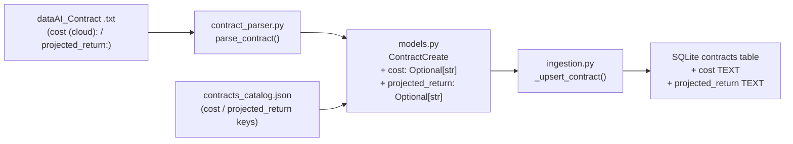

# Design Document: contract-fields-update

## Overview

This feature adds two new optional financial fields — `cost` and `projected_return` — to the Nexus contract data model. The change propagates end-to-end through five layers: the Pydantic model, the text parser/serializer, the SQLite schema, the ingestion engine, and the sample data files.

The scope is intentionally narrow: no new API endpoints, no UI changes, no new modules. Every change is additive and backward-compatible — existing contracts without these fields continue to work with `NULL` values.

**Key design decision:** `cost (cloud)` in the `.txt` format maps to the Python field name `cost`. The parenthetical `(cloud)` is part of the text-format key only; the Pydantic model and database column use the simpler name `cost`. The parser must handle the key `cost (cloud):` and the serializer must emit it back as `cost (cloud):` to preserve round-trip fidelity.

---

## Architecture

The change follows the existing data flow without introducing new components:



No new modules are introduced. All changes are confined to:
- `api/models.py`
- `api/contract_parser.py`
- `api/database.py`
- `api/ingestion.py`
- `data/samples/contracts_catalog.json`
- `data/samples/dataAI_Contract_ex1.txt`

---

## Components and Interfaces

### 1. Pydantic Model (`api/models.py`)

Two optional fields are appended to `ContractCreate`:

```python
cost: Optional[str] = None
projected_return: Optional[str] = None
```

Placement: after `docs_link`, before `usage` — keeping financial metadata grouped with the `info:` section fields.

### 2. Parser (`api/contract_parser.py` — `parse_contract`)

The parser already handles arbitrary `key: value` pairs under the `info:` section via the `info_fields` dict. The only change needed is in the final `ContractCreate` construction block, where two new lookups are added:

```python
cost=info_fields.get("cost (cloud)"),
projected_return=info_fields.get("projected_return"),
```

The key `"cost (cloud)"` matches the text-format key exactly (after `key, _, val = stripped.partition(":")`). No changes to the parsing loop are required.

### 3. Serializer (`api/contract_parser.py` — `serialize_contract`)

Two new lines are added to the `info:` block, after `docs_link`:

```python
if contract.cost is not None:
    out += f"  cost (cloud): {contract.cost}\n"
if contract.projected_return is not None:
    out += f"  projected_return: {contract.projected_return}\n"
```

Both fields are single-line strings (currency amounts), so the `_serialize_field` multi-line helper is not needed.

### 4. Database Schema (`api/database.py`)

Two nullable `TEXT` columns are added to the `CREATE TABLE IF NOT EXISTS contracts` statement:

```sql
cost TEXT,
projected_return TEXT,
```

**Migration note:** Because the table uses `CREATE TABLE IF NOT EXISTS`, existing databases will not automatically gain the new columns. For the PoC, the simplest approach is to delete `local_db/nexus.db` and let the app recreate it on startup. A lightweight migration helper using `ALTER TABLE ... ADD COLUMN` is included as a fallback (see Error Handling section).

### 5. Ingestion Engine (`api/ingestion.py` — `_upsert_contract`)

The `INSERT` and `UPDATE` SQL statements in `_upsert_contract` are extended to include the two new columns. No logic changes — the values flow directly from the `ContractCreate` object.

INSERT addition:
```sql
INSERT INTO contracts (
    ..., cost, projected_return
) VALUES (..., ?, ?)
```

UPDATE addition:
```sql
UPDATE contracts SET ..., cost = ?, projected_return = ? WHERE business_map_id = ?
```

The parameter tuples are extended accordingly.

---

## Data Models

### ContractCreate (updated)

| Field | Type | Required | Default | Source in .txt |
|---|---|---|---|---|
| `business_map_id` | `str` | yes | — | `id:` |
| `title` | `str` | yes | — | `info.title:` |
| `area` | `str` | yes | — | `info.area:` |
| `initiative` | `ContractInitiative` | yes | — | `info.initiative:` |
| `version` | `str` | no | `"1.0.0"` | `info.version:` |
| `description` | `str` | yes | — | `info.description:` |
| `owner` | `str` | yes | — | `info.owner:` |
| `status` | `ContractStatus` | no | `ACTIVE` | `info.status:` |
| `contact_name` | `Optional[str]` | no | `None` | `info.contact.name:` |
| `contact_email` | `Optional[str]` | no | `None` | `info.contact.email:` |
| `sec_approval` | `Optional[str]` | no | `None` | `info.sec_approval:` |
| `docs_link` | `Optional[str]` | no | `None` | `info.docs_link:` |
| **`cost`** | **`Optional[str]`** | **no** | **`None`** | **`info.cost (cloud):`** |
| **`projected_return`** | **`Optional[str]`** | **no** | **`None`** | **`info.projected_return:`** |
| `usage` | `Optional[str]` | no | `None` | `terms.usage:` |
| `limitations` | `Optional[str]` | no | `None` | `terms.limitations:` |

### SQLite `contracts` table (updated columns)

| Column | Type | Nullable | Notes |
|---|---|---|---|
| `cost` | `TEXT` | yes | Monthly cloud cost string |
| `projected_return` | `TEXT` | yes | Projected financial return string |

### Sample Data

`contracts_catalog.json`: every record gains `"cost"` and `"projected_return"` string keys.

`data/samples/dataAI_Contract_ex1.txt`: gains `cost (cloud):` and `projected_return:` lines in the `info:` section, matching the values already present in the root-level `dataAI_Contract_ex1.txt`.

---

## Correctness Properties

*A property is a characteristic or behavior that should hold true across all valid executions of a system — essentially, a formal statement about what the system should do. Properties serve as the bridge between human-readable specifications and machine-verifiable correctness guarantees.*

### Property 1: Model accepts new optional fields

*For any* string value (including `None`), a `ContractCreate` object instantiated with that value for `cost` and `projected_return` should store the value without raising a validation error, and the stored value should equal the input.

**Validates: Requirements 1.1, 1.2, 1.4**

---

### Property 2: Parser extracts new info fields

*For any* valid `dataAI_Contract` text that includes `cost (cloud):` and `projected_return:` lines in the `info:` section, calling `parse_contract()` should return a `ContractCreate` whose `cost` and `projected_return` fields equal the values present in the text.

**Validates: Requirements 2.1, 2.2**

---

### Property 3: Serialize/parse round-trip preserves new fields

*For any* `ContractCreate` object with non-null `cost` and `projected_return`, calling `serialize_contract()` followed by `parse_contract()` should produce a `ContractCreate` with `cost` and `projected_return` values equal to the originals.

**Validates: Requirements 2.4, 2.5**

---

### Property 4: Upsert persists new fields

*For any* `ContractCreate` object with arbitrary `cost` and `projected_return` values (including `None`), after calling `_upsert_contract()`, querying the `contracts` table by `business_map_id` should return rows where `cost` and `projected_return` match the values from the `ContractCreate` object. This holds for both insert (new record) and update (existing record) paths.

**Validates: Requirements 3.3, 3.4, 4.1, 4.2**

---

## Error Handling

### Missing optional fields (edge case — Requirements 2.3, 4.3)

Both `cost` and `projected_return` are optional. The parser uses `dict.get()` with no default, which returns `None` when the key is absent. The Pydantic model defaults both to `None`. The SQL columns are nullable. No special error handling is needed — the absence of these fields is the normal case for legacy contracts.

### Existing database without new columns (migration)

If `local_db/nexus.db` exists from a previous run, `CREATE TABLE IF NOT EXISTS` will not add the new columns. The recommended approach for the PoC is to delete the database file and restart. As a fallback, `database.py` should attempt `ALTER TABLE` migrations on startup:

```python
def _migrate_tables(conn) -> None:
    """Add new columns to existing tables if they don't exist yet."""
    existing = {row[1] for row in conn.execute("PRAGMA table_info(contracts)")}
    if "cost" not in existing:
        conn.execute("ALTER TABLE contracts ADD COLUMN cost TEXT")
    if "projected_return" not in existing:
        conn.execute("ALTER TABLE contracts ADD COLUMN projected_return TEXT")
    conn.commit()
```

This function is called from `create_tables()` after the `CREATE TABLE` statements.

### JSON ingestion with missing fields (edge case — Requirement 4.3)

`ContractCreate` already handles missing optional fields via Pydantic defaults. No additional error handling is needed in `_ingest_json`.

---

## Testing Strategy

### Unit Tests

Focus on specific examples and edge cases:

- Instantiate `ContractCreate` without `cost`/`projected_return` → both are `None`
- Instantiate `ContractCreate` with string values → values stored correctly
- Parse a contract text without the new fields → `cost` and `projected_return` are `None`
- Parse `data/samples/dataAI_Contract_ex1.txt` → `cost` and `projected_return` match expected values
- Verify `contracts_catalog.json` records all contain `cost` and `projected_return` keys
- Run `seed_sample_data()` against a fresh DB → zero errors in `IngestResult`
- Verify `PRAGMA table_info(contracts)` includes `cost` and `projected_return` columns

### Property-Based Tests

Use **Hypothesis** (Python property-based testing library). Each test runs a minimum of 100 iterations.

**Property 1 — Model accepts new optional fields**
```
# Feature: contract-fields-update, Property 1: model accepts new optional fields
@given(cost=st.one_of(st.none(), st.text()), projected_return=st.one_of(st.none(), st.text()))
def test_model_accepts_new_fields(cost, projected_return): ...
```

**Property 2 — Parser extracts new info fields**
```
# Feature: contract-fields-update, Property 2: parser extracts new info fields
@given(cost=st.text(min_size=1), projected_return=st.text(min_size=1))
def test_parser_extracts_new_fields(cost, projected_return): ...
```

**Property 3 — Serialize/parse round-trip**
```
# Feature: contract-fields-update, Property 3: serialize/parse round-trip preserves new fields
@given(contract=st.builds(ContractCreate, cost=st.text(min_size=1), projected_return=st.text(min_size=1), ...))
def test_round_trip(contract): ...
```

**Property 4 — Upsert persists new fields**
```
# Feature: contract-fields-update, Property 4: upsert persists new fields
@given(contract=st.builds(ContractCreate, cost=st.one_of(st.none(), st.text()), ...))
def test_upsert_persists_new_fields(contract): ...
```

Each property test must reference its design document property via the tag comment shown above.
