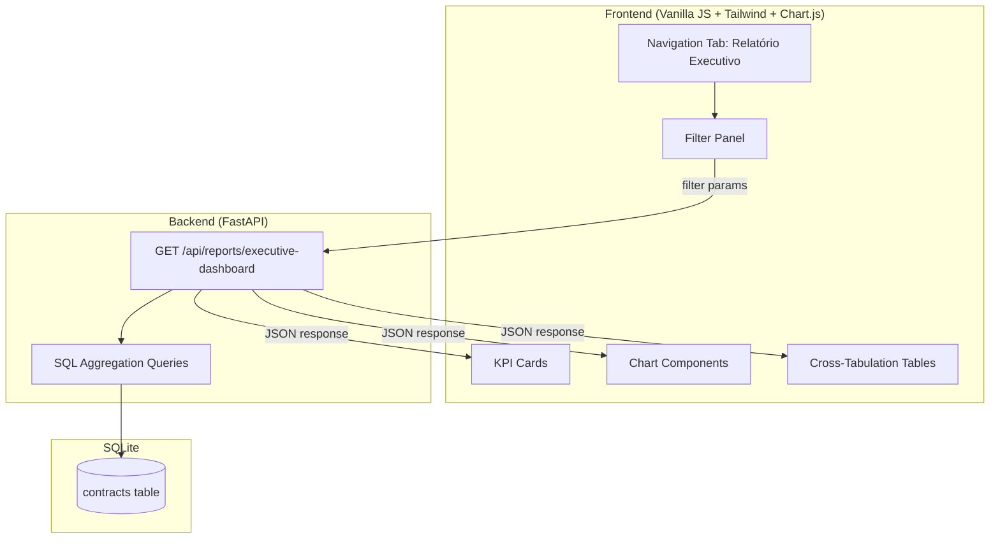

# Design Document: Executive Report Dashboard

## Overview

This design transforms the existing executive report from a simple modal into a full-featured dashboard tab within the Nexus Governance Platform. The dashboard targets C-level executives and provides KPI cards, distribution charts (via Chart.js), cross-tabulation tables, and dynamic filters — all powered by an enriched FastAPI endpoint that performs SQL aggregations against the SQLite `contracts` table.

The architecture follows the existing monolithic pattern: a single new API endpoint returns all aggregated data, and the frontend renders everything with vanilla JS + Tailwind CSS + Chart.js (all via CDN). No build step required.

## Architecture



### Design Decisions

1. **Single endpoint**: One `GET /api/reports/executive-dashboard` endpoint returns all aggregated data. This avoids multiple round-trips and keeps the frontend logic simple — one fetch, one render cycle.

2. **Server-side aggregation**: All GROUP BY and cross-tabulation logic runs in SQL. The frontend receives pre-computed counts and percentages, keeping JS logic minimal.

3. **New endpoint, preserve old**: The existing `/api/reports/executive` endpoint remains untouched for backward compatibility. The new endpoint lives at `/api/reports/executive-dashboard`.

4. **Chart.js via CDN**: Added as a `<script>` tag in `index.html`. No npm, no build step. Consistent with the existing Tailwind CDN approach.

## Components and Interfaces

### Backend Components

#### 1. Report API Endpoint (`api/routes/reports.py`)

New route function `executive_dashboard()` on `GET /api/reports/executive-dashboard`.

**Query Parameters:**
| Parameter    | Type            | Default | Description                        |
|-------------|-----------------|---------|-------------------------------------|
| `area`       | `Optional[str]` | `None`  | Filter by business area             |
| `initiative` | `Optional[str]` | `None`  | Filter by initiative type           |
| `status`     | `Optional[str]` | `None`  | Filter by contract status           |
| `owner`      | `Optional[str]` | `None`  | Filter by contract owner            |

**Behavior:**
- Builds a base SQL `WHERE` clause from provided filters
- Executes aggregation queries (GROUP BY) for each dimension
- Computes cross-tabulations via SQL with two GROUP BY columns
- Computes compliance metrics (sec_approval, docs_link)
- Returns a single `ExecutiveDashboardReport` Pydantic model

#### 2. Aggregation Helper (`api/routes/reports.py`)

A helper function `build_where_clause(area, initiative, status, owner)` that constructs a parameterized SQL WHERE clause and parameter tuple from the optional filter values.

```python
def build_where_clause(
    area: str | None,
    initiative: str | None,
    status: str | None,
    owner: str | None,
) -> tuple[str, list]:
    """Return (where_sql, params) for optional filters."""
    conditions = []
    params = []
    if area:
        conditions.append("area = ?")
        params.append(area)
    if initiative:
        conditions.append("initiative = ?")
        params.append(initiative)
    if status:
        conditions.append("status = ?")
        params.append(status)
    if owner:
        conditions.append("owner = ?")
        params.append(owner)
    where_sql = " AND ".join(conditions)
    if where_sql:
        where_sql = "WHERE " + where_sql
    return where_sql, params
```

### Frontend Components

#### 3. Navigation Tab (`frontend/index.html`)

A new `<button>` in the nav bar with `data-page="relatorio"` and a corresponding `<section id="page-relatorio">` in the main content area.

#### 4. Filter Panel (`frontend/app.js`)

A set of `<select>` dropdowns for area, initiative, status, and owner. On change, triggers a re-fetch of the dashboard data with the selected filter values as query parameters.

**Filter population:** On dashboard load, the frontend fetches the distinct values for each dimension from the API response's `by_area`, `by_initiative`, `by_status`, and `by_owner` fields (unfiltered first load) to populate dropdown options dynamically.

#### 5. KPI Cards (`frontend/app.js`)

Four cards rendered in a responsive grid:
- Total de Contratos (total)
- Contratos Ativos (active count)
- Em Desenvolvimento (development count)
- Conformidade de Governança (compliance %)

Each card shows a large number and a label. Compliance shows a percentage.

#### 6. Chart Components (`frontend/app.js`)

Four Chart.js instances:
- **Bar chart**: Contracts by initiative (`by_initiative`)
- **Pie chart**: Contracts by status (`by_status`)
- **Bar chart**: Contracts by area (`by_area`)
- **Horizontal bar chart**: Contracts by owner (`by_owner`)

Charts are destroyed and re-created on each data update (filter change) to avoid Chart.js canvas reuse issues.

#### 7. Cross-Tabulation Tables (`frontend/app.js`)

Two HTML tables rendered dynamically:
- Area × Initiative
- Area × Status

Each table includes row totals, column totals, and a grand total cell.

**Cross-table rendering logic:**
```
function renderCrossTable(crossData, rowLabel, colLabel):
    rows = unique row keys from crossData
    cols = unique col keys from crossData
    for each row:
        for each col:
            cell = crossData[row][col] or 0
        rowTotal = sum of row cells
    colTotals = sum of each column
    grandTotal = sum of all cells
```

## Data Models

### Pydantic Response Model (`api/models.py`)

```python
class ComplianceMetrics(BaseModel):
    sec_approval_count: int
    sec_approval_percentage: float
    docs_link_count: int
    docs_link_percentage: float

class CrossTabEntry(BaseModel):
    row: str
    col: str
    count: int

class ExecutiveDashboardReport(BaseModel):
    total_contracts: int
    by_status: dict[str, int]
    by_initiative: dict[str, int]
    by_area: dict[str, int]
    by_owner: dict[str, int]
    compliance: ComplianceMetrics
    cross_area_initiative: list[CrossTabEntry]
    cross_area_status: list[CrossTabEntry]
    filter_options: FilterOptions

class FilterOptions(BaseModel):
    areas: list[str]
    initiatives: list[str]
    statuses: list[str]
    owners: list[str]
```

### SQL Aggregation Queries

All queries share the same parameterized WHERE clause built by `build_where_clause()`.

| Aggregation              | SQL Pattern                                                                 |
|--------------------------|-----------------------------------------------------------------------------|
| Total                    | `SELECT COUNT(*) FROM contracts {where}`                                    |
| By status                | `SELECT status, COUNT(*) FROM contracts {where} GROUP BY status`            |
| By initiative            | `SELECT initiative, COUNT(*) FROM contracts {where} GROUP BY initiative`    |
| By area                  | `SELECT area, COUNT(*) FROM contracts {where} GROUP BY area`                |
| By owner                 | `SELECT owner, COUNT(*) FROM contracts {where} GROUP BY owner`              |
| Compliance (sec)         | `SELECT COUNT(*) FROM contracts {where} AND sec_approval IS NOT NULL`       |
| Compliance (docs)        | `SELECT COUNT(*) FROM contracts {where} AND docs_link IS NOT NULL`          |
| Cross: Area × Initiative | `SELECT area, initiative, COUNT(*) FROM contracts {where} GROUP BY area, initiative` |
| Cross: Area × Status     | `SELECT area, status, COUNT(*) FROM contracts {where} GROUP BY area, status`|
| Filter options           | `SELECT DISTINCT area FROM contracts` (and similar for each dimension)      |


## Correctness Properties

*A property is a characteristic or behavior that should hold true across all valid executions of a system — essentially, a formal statement about what the system should do. Properties serve as the bridge between human-readable specifications and machine-verifiable correctness guarantees.*

The following properties were derived from the acceptance criteria through prework analysis. Redundant criteria were consolidated (e.g., filtering appears in Requirements 2.2, 3.2, 3.4, 4.5, 5.4, 6.2, 7.3 — all subsumed by a single filtering property).

### Property 1: Filtering correctness

*For any* set of contracts in the database and *for any* combination of filter values (area, initiative, status, owner), all aggregations returned by the Report_API (totals, grouped counts, compliance metrics, cross-tabulations) SHALL reflect only the contracts that match all provided filter values.

**Validates: Requirements 2.2, 3.2, 3.4, 4.5, 5.4, 6.2, 7.3**

### Property 2: Aggregation invariant

*For any* set of contracts and *for any* grouping dimension (status, initiative, area, owner), the sum of all group counts SHALL equal the total contract count, and each individual group count SHALL equal the number of contracts with that dimension value.

**Validates: Requirements 2.1, 4.1, 4.2, 4.3, 4.4**

### Property 3: Compliance calculation correctness

*For any* set of contracts, the compliance percentage for a given field (sec_approval or docs_link) SHALL equal the count of contracts where that field is non-null divided by the total number of contracts, multiplied by 100. When total is zero, compliance SHALL be 0.

**Validates: Requirements 2.3, 7.1, 7.2**

### Property 4: Cross-tabulation correctness

*For any* set of contracts and *for any* pair of dimensions (e.g., area × initiative, area × status), each cell in the cross-tabulation SHALL equal the count of contracts matching both the row dimension value and the column dimension value.

**Validates: Requirements 5.1, 5.2**

### Property 5: Cross-tabulation totals invariant

*For any* cross-tabulation table, the sum of all cells in a row SHALL equal the row total, the sum of all cells in a column SHALL equal the column total, and the sum of all row totals SHALL equal the sum of all column totals SHALL equal the grand total.

**Validates: Requirements 5.3**

## Error Handling

| Scenario                              | Handling                                                                 |
|---------------------------------------|--------------------------------------------------------------------------|
| No contracts match filters            | Return zero counts, empty dicts, empty cross-tab lists, 0% compliance.   |
| Invalid filter value (not in DB)      | Treat as valid filter — returns zero results (no error).                 |
| Database connection failure           | FastAPI returns 500 with JSON error detail.                              |
| Chart.js rendering failure            | Frontend catches error, shows "Erro ao renderizar gráfico" message.      |
| API fetch failure from frontend       | Frontend shows "Erro ao carregar relatório" message in the dashboard.    |

## Testing Strategy

### Property-Based Testing

**Library:** [Hypothesis](https://hypothesis.readthedocs.io/) for Python.

Each correctness property maps to a single Hypothesis test. Tests generate random contract datasets (using `@st.composite` strategies for Contract objects) and random filter combinations, then verify the property holds.

**Configuration:** Minimum 100 examples per test via `@settings(max_examples=100)`.

**Tag format:** Each test includes a docstring comment:
```
Feature: executive-report-dashboard, Property N: <property title>
```

**Properties to implement:**
- Property 1: Generate random contracts + random filters → verify all aggregations match manual filtering
- Property 2: Generate random contracts → verify sum of group counts = total for each dimension
- Property 3: Generate random contracts with random sec_approval/docs_link values → verify compliance formula
- Property 4: Generate random contracts → verify cross-tab cells match dual-filtered counts
- Property 5: Generate random cross-tab data → verify row/column/grand totals are consistent

### Unit Testing

**Library:** pytest

Unit tests cover specific examples and edge cases:
- Empty database returns all zeros
- Single contract returns correct aggregations
- Filters that match nothing return empty results
- API response schema validation (Pydantic model)
- `build_where_clause` with various filter combinations
- Frontend rendering of KPI cards, charts, and tables (manual/visual — not automated)

### Test Balance

- Property tests handle comprehensive input coverage (random contracts, random filters)
- Unit tests handle specific edge cases (empty DB, single record, boundary values)
- Frontend behavior (navigation, DOM updates) tested manually as this is a PoC
