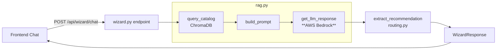

# Design Document: Wizard AWS Bedrock

## Overview

This design covers the surgical replacement of the Ollama HTTP client in `api/rag.py` with an AWS Bedrock boto3 client. The change is intentionally minimal: only the `get_llm_response` function and its surrounding configuration change. Every other component — ChromaDB indexing, `query_catalog`, `build_prompt`, `extract_recommendation`, the `/api/wizard/chat` endpoint, and the frontend — remains untouched.

The new LLM backend calls Claude Sonnet via the Bedrock `converse` API, which provides a clean messages-style interface and handles cross-region inference profiles transparently.

---

## Architecture

The RAG pipeline flow is unchanged. Only the LLM invocation box changes provider.



The only file that changes meaningfully is `api/rag.py`. The `api/routes/wizard.py` error-handling block is updated to catch `botocore` exceptions instead of `httpx` exceptions.

---

## Components and Interfaces

### `api/rag.py` — modified sections

**Removed:**
- `import httpx`
- `OLLAMA_BASE_URL`, `OLLAMA_MODEL`, `OLLAMA_TIMEOUT` constants
- `get_llm_response` implementation that calls Ollama

**Added:**
- `import boto3`, `import botocore.exceptions`
- `AWS_REGION`, `AWS_ACCESS_KEY_ID`, `AWS_SECRET_ACCESS_KEY`, `BEDROCK_MODEL_ARN`, `BEDROCK_TIMEOUT` constants read from `os.environ`
- `_get_bedrock_client()` — creates and returns a `boto3` client for `bedrock-runtime`
- `get_llm_response(prompt: str) -> str` — new implementation using Bedrock `converse` API

**Unchanged:**
- `_get_chroma_client()`, `_get_collection()`
- `index_contract()`, `index_all_contracts()`
- `query_catalog()`
- `build_prompt()`

### `api/routes/wizard.py` — modified sections

**Changed:**
- `import httpx` removed; `import botocore.exceptions` added
- Exception handlers in `wizard_chat` updated to catch `botocore.exceptions.ClientError` (→ 503) and `botocore.exceptions.EndpointResolutionError` (→ 503) instead of `httpx.ConnectError` / `httpx.HTTPStatusError`
- Timeout handling catches `botocore.exceptions.ReadTimeoutError` (→ 504)

**Unchanged:**
- Endpoint path, request/response models, whitespace guard, routing logic, response building

### `requirements.txt`

- Add `boto3>=1.34.0`
- `httpx` may remain (used elsewhere or as a transitive dep) but Ollama-specific usage is removed from `rag.py`

---

## Data Models

No new Pydantic models are required. The existing `ChatMessage` and `WizardResponse` models are unchanged.

The Bedrock `converse` API request payload (internal, not exposed via Pydantic):

```python
{
    "modelId": arn:aws:bedrock:us-east-1:200624937306:application-inference-profile/swysnpyzljzd,          # "cloude-sonnet-45"
    "messages": [
        {"role": "user", "content": [{"text": prompt}]}
    ],
    "inferenceConfig": {
        "maxTokens": 1024,
        "temperature": 0.3,
    }
}
```

The response path to extract text:
```python
response["output"]["message"]["content"][0]["text"]
```

---

## Correctness Properties

*A property is a characteristic or behavior that should hold true across all valid executions of a system — essentially, a formal statement about what the system should do. Properties serve as the bridge between human-readable specifications and machine-verifiable correctness guarantees.*

Property 1: RAG pipeline output is structurally valid
*For any* non-empty chat message, the `/api/wizard/chat` endpoint SHALL return a response that conforms to the `WizardResponse` schema (i.e., `answer` is a non-empty string, `recommended_tool` is a valid `ToolSolution` or null, `similar_projects` is a list).
**Validates: Requirements 4.1, 2.1**

Property 2: Whitespace-only messages are always rejected
*For any* string composed entirely of whitespace characters, submitting it to `/api/wizard/chat` SHALL return HTTP 422 and the task list SHALL remain unchanged.
**Validates: Requirements 4.2**

Property 3: Bedrock client error maps to 503
*For any* `botocore.exceptions.ClientError` raised by the Bedrock client, the endpoint SHALL return HTTP 503 with a non-empty Portuguese error message.
**Validates: Requirements 4.3, 4.4**

Property 4: Environment variable override is respected
*For any* value assigned to `BEDROCK_MODEL_ARN` in the environment, the `Bedrock_Client` SHALL use that value as the `modelId` in every Bedrock API call.
**Validates: Requirements 5.3**

Property 5: Routing logic is deterministic given LLM output
*For any* LLM response string that contains the pattern `RECOMENDAÇÃO: <tool>`, `extract_recommendation` SHALL return the corresponding `ToolSolution` — independent of which LLM backend produced the string.
**Validates: Requirements 3.1, 3.2**

Property 6: Prompt always contains catalog context block
*For any* list of `Contract` objects (including the empty list), `build_prompt` SHALL return a string that contains either the catalog context block or the "no contracts found" fallback message — never an empty context section.
**Validates: Requirements 2.2, 2.3, 2.4**

---

## Error Handling

| Scenario | Exception | HTTP Status | Message (PT) |
|---|---|---|---|
| AWS credentials missing / invalid | `botocore.exceptions.ClientError` | 503 | "Serviço de IA indisponível. Verifique as credenciais AWS." |
| Endpoint unreachable | `botocore.exceptions.EndpointResolutionError` | 503 | "Serviço de IA indisponível. Verifique a configuração da região AWS." |
| Bedrock call timeout | `botocore.exceptions.ReadTimeoutError` | 504 | "Tempo de resposta excedido." |
| ChromaDB unavailable | `Exception` (generic) | 503 | "Serviço de busca indisponível." |
| Whitespace-only message | — (guard clause) | 422 | "A mensagem não pode ser vazia ou conter apenas espaços." |

Missing credential env vars are logged as warnings at startup (not fatal — allows the app to start for catalog/delivery features even if Bedrock is misconfigured).

---

## Testing Strategy

**Dual approach: unit tests + property-based tests.**

Unit tests cover specific examples and error paths. Property-based tests (using `hypothesis`) verify universal correctness across generated inputs.

### Unit Tests (`tests/test_wizard_bedrock.py`)

- Mock `boto3.client` to return a canned Bedrock response; assert `get_llm_response` returns the extracted text.
- Mock `boto3.client` to raise `ClientError`; assert the endpoint returns 503.
- Mock `boto3.client` to raise `ReadTimeoutError`; assert the endpoint returns 504.
- Assert `BEDROCK_MODEL_ARN` env var is passed as `modelId` in the boto3 call.
- Assert startup warning is logged when `AWS_ACCESS_KEY_ID` is absent.

### Property-Based Tests (`tests/test_wizard_bedrock_properties.py`)

Using `hypothesis` with minimum 100 examples per property.

- **Property 1** — `Feature: wizard-aws-bedrock, Property 1: RAG pipeline output is structurally valid`
  Generate random non-empty strings as chat messages; mock Bedrock to return a fixed answer; assert response matches `WizardResponse` schema.

- **Property 2** — `Feature: wizard-aws-bedrock, Property 2: Whitespace-only messages are always rejected`
  Generate strings from `st.text(alphabet=" \t\n\r")` with `min_size=1`; assert endpoint returns 422.

- **Property 3** — `Feature: wizard-aws-bedrock, Property 3: Bedrock client error maps to 503`
  Generate random `ClientError` error codes; mock boto3 to raise them; assert endpoint returns 503.

- **Property 5** — `Feature: wizard-aws-bedrock, Property 5: Routing logic is deterministic given LLM output`
  Generate random tool names from `ToolSolution`; construct a response string with `RECOMENDAÇÃO: <tool>`; assert `extract_recommendation` returns the correct `ToolSolution`.

- **Property 6** — `Feature: wizard-aws-bedrock, Property 6: Prompt always contains catalog context block`
  Generate random lists of `Contract` objects (including empty); assert `build_prompt` output always contains either the catalog block header or the "no contracts" fallback string.
