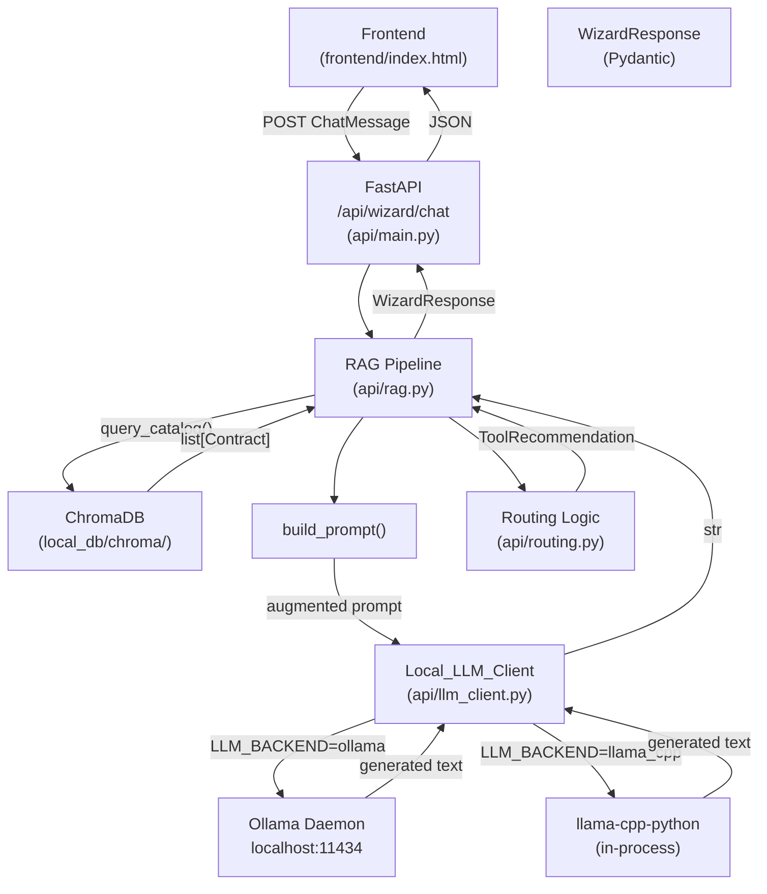
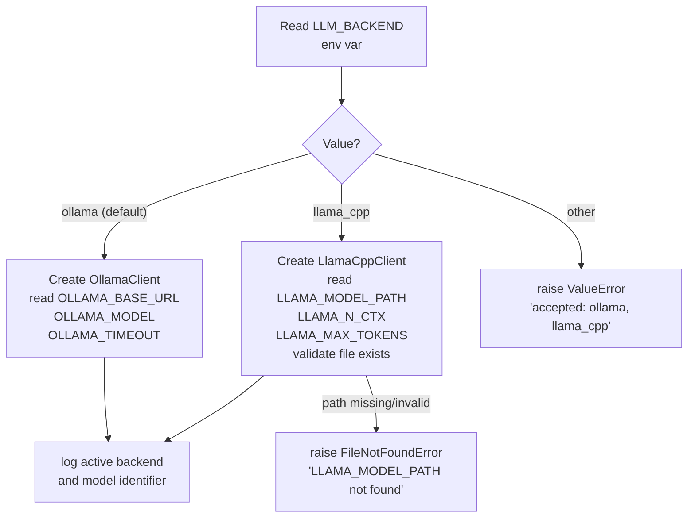

# Design Document: Wizard Local LLM Migration

## Overview

This migration replaces the AWS Bedrock invocation layer in `api/rag.py` with a `Local_LLM_Client` abstraction that supports two local runtimes: **Ollama** (primary, HTTP-based) and **llama-cpp-python** (fallback, in-process). Every other component — ChromaDB vector search, prompt augmentation, strategic routing, and the `/api/wizard/chat` HTTP contract — remains untouched.

The change is intentionally narrow: one new file (`api/llm_client.py`) replaces the `get_llm_response` function and its Bedrock dependencies. The rest of `api/rag.py` calls the same interface. This keeps the diff small and easy for a Junior Data Scientist to review, debug, and extend.

### Goals

- Zero API costs and zero cloud credentials required to run the Wizard.
- Operator can switch between Ollama and llama-cpp-python by changing a single environment variable.
- All existing tests and the frontend chat interface continue to work without modification.

---

## Architecture

The diagram below shows the full request flow after migration. The only change from the current architecture is the replacement of the **AWS Bedrock** box with **Local_LLM_Client**.



### Backend Selection at Startup



---

## Components and Interfaces

### New: `api/llm_client.py`

This is the only new file. It contains:

1. **`BaseLLMClient`** — abstract base class with a single method `generate(prompt: str) -> str`.
2. **`OllamaClient`** — concrete implementation using `httpx` to POST to the Ollama HTTP API.
3. **`LlamaCppClient`** — concrete implementation using `llama_cpp.Llama` loaded from a local GGUF file.
4. **`get_llm_client()`** — factory function that reads `LLM_BACKEND` and returns the appropriate client instance. Called once at module import time and cached as a module-level singleton.

```python
# api/llm_client.py  (interface sketch)

class BaseLLMClient:
    def generate(self, prompt: str) -> str:
        raise NotImplementedError

class OllamaClient(BaseLLMClient):
    def __init__(self, base_url: str, model: str, timeout: int): ...
    def generate(self, prompt: str) -> str:
        # POST to {base_url}/api/generate
        # raises ConnectionError on non-2xx or network failure
        ...

class LlamaCppClient(BaseLLMClient):
    def __init__(self, model_path: str, n_ctx: int, max_tokens: int): ...
    def generate(self, prompt: str) -> str:
        # calls self._llm(prompt=prompt, max_tokens=self.max_tokens)
        ...

def get_llm_client() -> BaseLLMClient:
    # reads LLM_BACKEND, constructs and returns the right client
    # raises ValueError for unknown backend
    # raises FileNotFoundError if llama_cpp path is missing
    ...
```

### Modified: `api/rag.py`

Only the LLM invocation section changes:

- **Remove**: `import boto3`, `import botocore.exceptions`, all `AWS_*` / `BEDROCK_*` config constants, `_get_bedrock_client()`, and `get_llm_response()`.
- **Add**: `from api.llm_client import get_llm_client` and a one-line call `_llm_client = get_llm_client()`.
- **Replace** the `get_llm_response(prompt)` call site with `_llm_client.generate(prompt)`.

Everything else in `api/rag.py` (`index_contract`, `index_all_contracts`, `query_catalog`, `build_prompt`) is **unchanged**.

### Unchanged: `api/routing.py`

No modifications. `extract_recommendation` and `ToolRecommendation` are unaffected.

### Unchanged: `api/main.py` (chat endpoint)

The endpoint already catches generic exceptions and maps them to HTTP status codes. The only addition is catching `ConnectionError` → 503 and `TimeoutError` → 504 explicitly, which may already be present. The `WizardResponse` schema and `ChatMessage` input schema are untouched.

---

## Data Models

No new Pydantic models are introduced. The existing models remain:

```python
# api/models.py (existing, unchanged)

class ChatMessage(BaseModel):
    message: str  # validated non-empty by the endpoint

class WizardResponse(BaseModel):
    response: str
    tool_recommendation: str
    justification: str
    similar_contracts: list[str]

class Contract(BaseModel):
    id: int
    business_map_id: str
    title: str
    area: str
    initiative: str
    version: str
    description: str
    owner: str
    status: str
    contact_name: str | None
    contact_email: str | None
    sec_approval: str | None
    docs_link: str | None
    usage: str | None
    limitations: str | None
    created_at: str | None
    updated_at: str | None
```

### Environment Variable Configuration

All configuration is read at startup via `os.environ.get()`. The table below is the complete reference:

| Variable | Default | Backend | Description |
|---|---|---|---|
| `LLM_BACKEND` | `ollama` | both | Selects runtime: `ollama` or `llama_cpp` |
| `OLLAMA_BASE_URL` | `http://localhost:11434` | ollama | Ollama daemon base URL |
| `OLLAMA_MODEL` | `llama3` | ollama | Model name served by Ollama |
| `OLLAMA_TIMEOUT` | `120` | ollama | HTTP request timeout in seconds |
| `LLAMA_MODEL_PATH` | *(required)* | llama_cpp | Absolute path to the GGUF model file |
| `LLAMA_N_CTX` | `2048` | llama_cpp | Context window size |
| `LLAMA_MAX_TOKENS` | `512` | llama_cpp | Max tokens to generate |

The removed variables (`AWS_REGION`, `AWS_ACCESS_KEY_ID`, `AWS_SECRET_ACCESS_KEY`, `BEDROCK_MODEL_ARN`, `BEDROCK_TIMEOUT`) are no longer read anywhere in the codebase.

---


## Correctness Properties

*A property is a characteristic or behavior that should hold true across all valid executions of a system — essentially, a formal statement about what the system should do. Properties serve as the bridge between human-readable specifications and machine-verifiable correctness guarantees.*

### Property 1: Ollama client routes to the configured URL

*For any* prompt string, when `LLM_BACKEND=ollama`, the `OllamaClient` SHALL make an HTTP POST request to the URL derived from `OLLAMA_BASE_URL` — regardless of the prompt content.

**Validates: Requirements 1.2, 2.1**

---

### Property 2: llama-cpp client invokes the loaded model

*For any* prompt string, when `LLM_BACKEND=llama_cpp`, the `LlamaCppClient` SHALL call the loaded `Llama` instance with that prompt — regardless of the prompt content.

**Validates: Requirements 1.3**

---

### Property 3: Client extracts and returns generated text

*For any* valid response payload returned by the backend (Ollama JSON or llama-cpp completion dict), the client SHALL extract and return a non-empty string containing the generated text.

**Validates: Requirements 2.5, 3.6**

---

### Property 4: Ollama connection errors surface as ConnectionError

*For any* HTTP status code that is not 2xx, or any network-level failure when calling the Ollama endpoint, the `OllamaClient.generate()` method SHALL raise a `ConnectionError`.

**Validates: Requirements 2.6**

---

### Property 5: build_prompt always includes all four required sections

*For any* user query string and *any* list of `Contract` objects (including an empty list), `build_prompt(query, context)` SHALL return a string that contains: (a) the system persona text, (b) the available tools list, (c) a catalog context block (either the contracts or the "no contracts found" message), and (d) the user query.

**Validates: Requirements 4.3, 4.4**

---

### Property 6: RAG pipeline round-trip — query in, WizardResponse out

*For any* non-empty, non-whitespace query string, the full RAG pipeline (ChromaDB search → prompt augmentation → LLM call → routing) SHALL return a `WizardResponse` with non-empty `response`, `tool_recommendation`, and `justification` fields.

**Validates: Requirements 4.5, 6.1**

---

### Property 7: extract_recommendation always returns a valid ToolSolution

*For any* LLM response string — whether it contains the `RECOMENDAÇÃO:` pattern, a bare tool keyword, or neither — `extract_recommendation()` SHALL return a `ToolRecommendation` whose `.tool` is a member of the `ToolSolution` enum.

**Validates: Requirements 5.1, 5.2, 5.3, 5.4**

---

### Property 8: extract_recommendation is idempotent

*For any* LLM response string `text`, calling `extract_recommendation(text)` twice SHALL return the same `ToolSolution` value both times.

**Validates: Requirements 5.5**

---

### Property 9: Whitespace-only messages are rejected with HTTP 422

*For any* string composed entirely of whitespace characters (spaces, tabs, newlines), submitting it as the `message` field to `POST /api/wizard/chat` SHALL return HTTP 422.

**Validates: Requirements 6.2**

---

### Property 10: Unrecognised LLM_BACKEND raises ValueError at startup

*For any* string that is not `"ollama"` or `"llama_cpp"`, calling `get_llm_client()` with that value as `LLM_BACKEND` SHALL raise a `ValueError` whose message lists the accepted values.

**Validates: Requirements 7.4**

---

## Error Handling

| Condition | Raised by | Caught in | HTTP Response |
|---|---|---|---|
| Ollama unreachable / non-2xx | `OllamaClient.generate()` | `api/main.py` chat endpoint | 503 + Portuguese message |
| Ollama HTTP timeout | `OllamaClient.generate()` | `api/main.py` chat endpoint | 504 |
| `LLAMA_MODEL_PATH` missing or file not found | `LlamaCppClient.__init__()` | App startup / `api/main.py` | 503 at startup |
| `LLM_BACKEND` unrecognised value | `get_llm_client()` | App startup | Process exits with `ValueError` |
| Whitespace-only `ChatMessage.message` | Pydantic validator | FastAPI request validation | 422 |
| ChromaDB unavailable | `query_catalog()` | `api/rag.py` (returns `[]`) | Pipeline continues with empty context |

**Design decision**: ChromaDB failures are silently degraded to an empty context list (existing behaviour in `query_catalog`). The LLM is still called with a "no contracts found" prompt. This avoids a hard failure for a non-critical enrichment step.

**Error messages** for 503 responses are written in Portuguese to match the product's language requirement (e.g., `"Serviço LLM local indisponível. Verifique se o Ollama está em execução."`).

---

## Testing Strategy

### Dual Testing Approach

Both unit tests and property-based tests are required. They are complementary:

- **Unit tests** cover specific examples, error conditions, and integration points (e.g., "given a mocked Ollama returning 503, the endpoint returns HTTP 503").
- **Property tests** verify universal invariants across many generated inputs (e.g., "for any prompt string, the Ollama client always POSTs to the right URL").

### Property-Based Testing

**Library**: `hypothesis` (already in `requirements.txt`).

Each property test runs a minimum of **100 iterations** via `@settings(max_examples=100)`.

Each test is tagged with a comment in the format:
`# Feature: wizard-local-llm-migration, Property N: <property_text>`

| Property | Test location | Hypothesis strategy |
|---|---|---|
| P1: Ollama routes to configured URL | `tests/test_llm_client.py` | `st.text()` for prompt |
| P2: llama-cpp invokes loaded model | `tests/test_llm_client.py` | `st.text()` for prompt |
| P3: Client extracts generated text | `tests/test_llm_client.py` | `st.fixed_dictionaries(...)` for response payload |
| P4: Ollama errors → ConnectionError | `tests/test_llm_client.py` | `st.integers(400, 599)` for status codes |
| P5: build_prompt contains all sections | `tests/test_rag.py` | `st.text()` for query, `st.lists(...)` for contracts |
| P6: RAG pipeline round-trip | `tests/test_rag.py` | `st.text(min_size=1)` for query (LLM mocked) |
| P7: extract_recommendation → valid ToolSolution | `tests/test_routing.py` | `st.text()` for LLM response |
| P8: extract_recommendation idempotent | `tests/test_routing.py` | `st.text()` for LLM response |
| P9: Whitespace → HTTP 422 | `tests/test_api.py` | `st.text(alphabet=st.characters(whitelist_categories=('Zs',)))` |
| P10: Bad LLM_BACKEND → ValueError | `tests/test_llm_client.py` | `st.text().filter(lambda s: s not in ('ollama','llama_cpp'))` |

### Unit Tests

Unit tests focus on:

- **Configuration examples**: verify each env var is read correctly (e.g., `OLLAMA_MODEL` overrides the default `llama3`).
- **Error mapping examples**: `ConnectionError` → HTTP 503, `TimeoutError` → HTTP 504, missing `LLAMA_MODEL_PATH` → HTTP 503 at startup.
- **Dependency removal example**: assert `boto3` is not importable from `api.rag` (or that `api.rag` has no `boto3` attribute).
- **`requirements.txt` content examples**: assert `boto3` is absent and `httpx>=0.25.0` is present.

### File Layout

```
tests/
  test_llm_client.py   # P1, P2, P3, P4, P10 + config unit tests
  test_rag.py          # P5, P6 + build_prompt unit tests
  test_routing.py      # P7, P8 + routing unit tests (existing, extended)
  test_api.py          # P9 + HTTP error mapping unit tests
```
